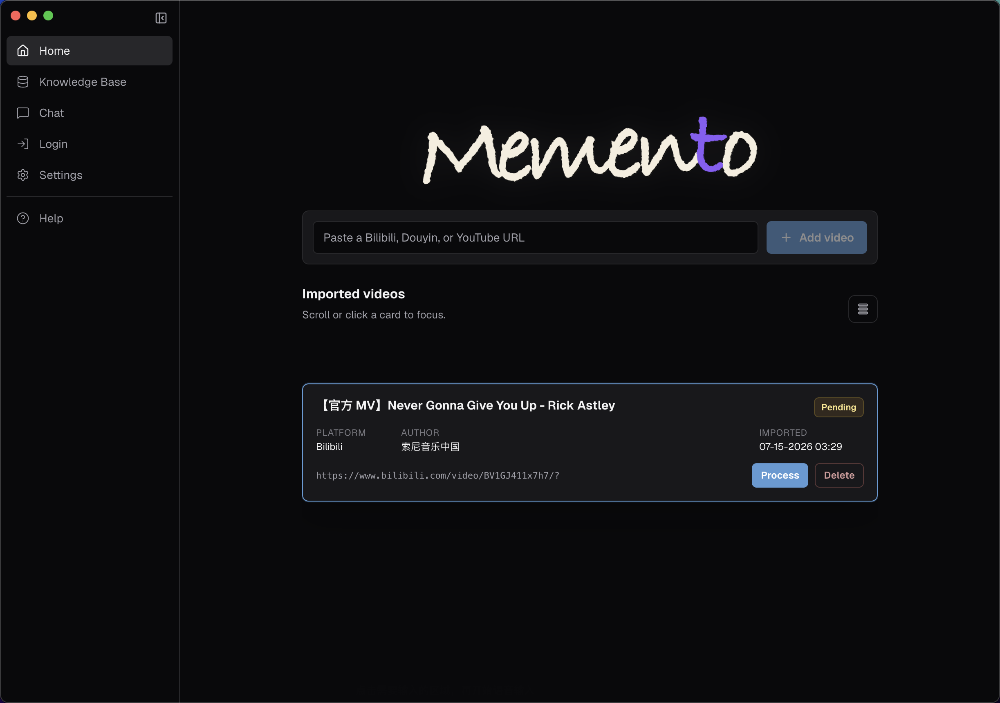
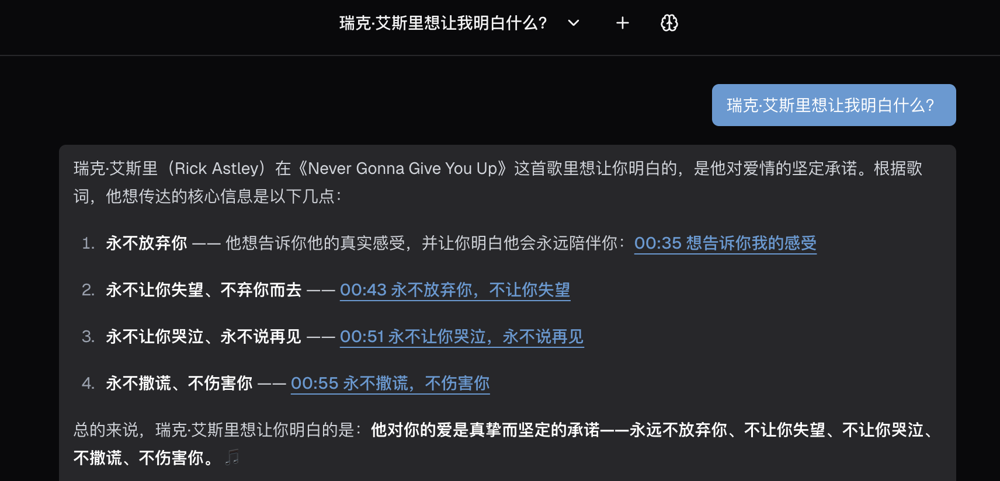
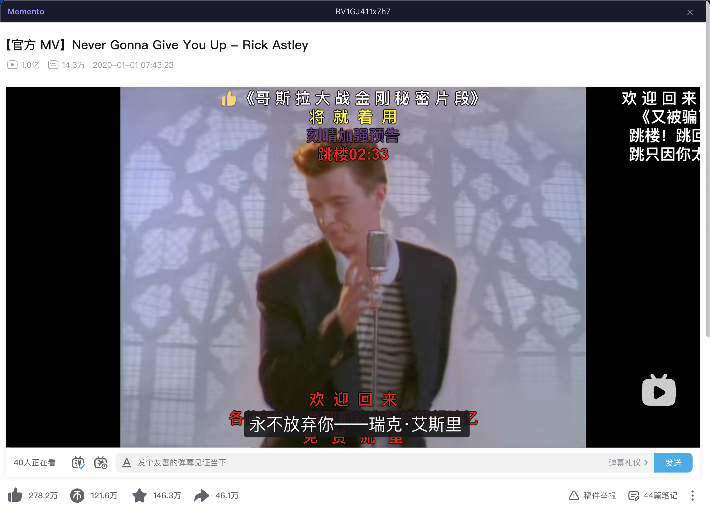

# Memento

English | [简体中文](./README.md)

**Turn videos into a queryable, source-traceable knowledge base on your own machine.**



Paste a Bilibili, Douyin, or YouTube video link, and Memento extracts the subtitles automatically (transcribing the audio via ASR when none are available) and organizes them into your own knowledge base. From there, you can ask questions, summarize, and search through the video content in a conversation — every answer comes with a timestamp that links back to the exact moment in the original video for verification.

---

## What problems does it solve

- **Watched it, forgot it** — You finish a pile of tutorials, interviews, and talks, only to forget two days later which episode covered the part you need.
- **You can't search a video** — You want to ask "what did that video say about XX?", but videos aren't searchable.
- **You don't want your data in the cloud** — You'd rather keep the knowledge base on your own computer.

## Three core capabilities

### 1. Layered knowledge: no detail or overview lost

Ordinary video Q&A usually grabs only the few most relevant subtitle fragments, so answers to "what is this whole video about?" end up incomplete. Memento builds a three-layer knowledge structure for every video:

- **L1 Verbatim** — the subtitles line by line, each with a timestamp, for precise location and citation of specific content.
- **L2 Summary** — a content summary of the video (a paragraph or two) that lays out the key points and overall flow, so you can grasp the full picture of a single video without rewatching it.
- **L3 Description** — like a video description: one sentence on what the video is about. As the knowledge base accumulates many videos, it's used to quickly judge whether a video is relevant to your question and to discover the right target.

When you ask a question, the AI selects the layer to query based on the type of question: for specifics, it searches L1 verbatim fragments directly; for holistic or exploratory questions, it first locates relevant videos via the L3 description, then reads the L2 summary to go deeper when needed.

### 2. Self-hosted model services with GPU acceleration

Speech-to-text (ASR) and vectorization (Embedding) are computationally heavy. Memento runs both as **independent services**: each has its own isolated environment and process, and can be deployed on your local machine or moved entirely onto another machine (for example, borrowing the GPU of a host on your local network), keeping the desktop app lightweight.

- **GPU acceleration** — automatically detects and uses **NVIDIA GPUs (CUDA)** and **Apple Silicon GPUs (MPS)**, significantly speeding up transcription and vectorization.
- **A lightweight desktop app** — compute-heavy work is offloaded to the independent services, so the app focuses on the interactive experience.

There are two ways to deploy these services:

- **Local deployment** — ASR can be deployed with one click via the Deploy button in the app's Settings; both can also be deployed locally with the script below.
- **Deployment on another machine** — fetch the `services` directory on the target machine and run the deployment script, then enter the service address in Settings to use it.

Download just the `services` directory (no need to clone the whole repo):

```bash
git clone --filter=blob:none --sparse https://github.com/ChickmagnetL/Memento.git
cd Memento
git sparse-checkout set services
python services/node/bootstrap.py
```

The script runs in an isolated environment (cross-platform, automatic device detection) and guides you through installing dependencies and starting the services. This is for users who choose "local" models; if you use cloud APIs, no deployment is needed and you can skip this entirely.

### 3. Traceable answers: verifiable, not just trusting the model

Every answer includes timestamp references to the original video; click one to play from that exact position. You can return to the source at any time to verify, rather than having to take the model's output on faith. Combined with hybrid retrieval that blends keyword and semantic search (each covering the other's blind spots, balancing hit rate with relevance), the answers are both accurate and verifiable.

> Note: Bilibili and YouTube support jumping to the exact position when you click a timestamp. Douyin does not support timestamp parameters on the platform side, so clicking opens the video and you'll need to seek to the time manually.





## Other features

- **One link to ingest** — supports Bilibili, Douyin, and public YouTube videos; subtitles are preferred when available, and you can fall back to audio transcription when they're not.
- **Local first** — the knowledge base is stored locally, with no forced cloud dependency.
- **Swappable models** — the chat and embedding models can use cloud APIs (DeepSeek, SiliconFlow, OpenAI-compatible interfaces) or local Ollama.
- **Remembers your preferences** — retains your habits across sessions; long-term preferences are proposed by the AI and only written after you confirm, avoiding silently recording incorrect or outdated information.

## Installation

### macOS

1. Download [Memento-macOS.dmg](https://github.com/ChickmagnetL/Memento/releases/latest/download/Memento-macOS.dmg).
2. Open the `.dmg` and drag Memento into Applications.
3. Because the app is unsigned, the first launch will be blocked by the system. Open Terminal and run the following command to clear the quarantine attribute, after which it will start normally:

```bash
xattr -cr /Applications/Memento.app
```

### Windows

1. Download the [Memento-Windows.exe](https://github.com/ChickmagnetL/Memento/releases/latest/download/Memento-Windows.exe) installer and run it, following the prompts to complete installation.
2. The first launch may trigger a SmartScreen prompt — click "More info" → "Run anyway" to proceed.

## Quick start

Before first use, configure two types of models in **Settings** (both required):

- **Chat model** — handles conversational Q&A, as well as subtitle cleaning and summary generation before documents are indexed.
- **Embedding model** — vectorizes the video content for indexing.

Both can use cloud APIs or local Ollama, and multiple configurations are managed via presets in Settings. Once configured, follow these steps:

1. **Add a video** — paste the video link on the Home page and add it.
2. **Process the video** — click "Process" to extract subtitles; when none are available, you can choose to download the audio and transcribe it.
3. **Index and ask** — in Knowledge Base, select a document to index (vectorize) it, then go to Chat to ask questions; click a timestamp in an answer to play from that position in the video.

## Technical docs

To dive deeper into the system design, check these technical docs (in-repo `docs/technical/` is kept in sync with the online Wiki):

- [System overview](docs/technical/system-overview.md) — components and runtime architecture
- [Video intake pipeline](docs/technical/video-pipeline.md) — the full flow from link to searchable knowledge
- [Storage and retrieval](docs/technical/storage-and-retrieval.md) — data layout, chunking, hybrid retrieval, and index rebuilding
- [Memory architecture](docs/technical/memory-architecture.md) — the design of sessions, layered knowledge, and personal preferences
- [Standalone services and configuration](docs/technical/services-and-config.md) — ASR / Embedding services and model configuration

Online Wiki: <https://chickmagnetl.github.io/Memento/#/>

## FAQ

<details>
<summary><b>New here — is there a tutorial?</b></summary>

The **Help** page in the sidebar provides a complete app tutorial. We recommend starting there.

</details>

<details>
<summary><b>Where is my data stored?</b></summary>

Business data such as conversations, the knowledge base, and personal preferences is stored on your local machine; model calls access their configured endpoints (local or cloud) according to Settings. The two are independent of each other.

</details>

<details>
<summary><b>Does it need an internet connection?</b></summary>

Importing a video requires accessing the platform to fetch its content; processing and chatting require accessing the model endpoints. With local models, you can work offline except for the initial download.

</details>

<details>
<summary><b>Do the models cost money?</b></summary>

It depends on your configuration. Cloud APIs (such as DeepSeek, SiliconFlow) are billed per usage by each provider; local models (Ollama or self-hosted ASR / Embedding services) incur no extra cost beyond hardware.

</details>

<details>
<summary><b>What about videos without subtitles?</b></summary>

You can download the audio and generate a transcript via ASR transcription, then clean and index it.

</details>

<details>
<summary><b>Do I need to log in to a platform account?</b></summary>

Some content on Bilibili and Douyin (such as AI subtitles) requires a logged-in state. You don't need to prepare cookies in advance — the app has a built-in official platform login entry where you can scan a QR code or sign in directly. Public content also works without logging in.

</details>

<details>
<summary><b>Is it safe to log in inside the app?</b></summary>

Login happens on the platform's official page, running inside an isolated session within the app; the app never touches your plaintext password. After login, only the session credentials used for fetching are retained and stored on your local machine. Note that, like any other sensitive data on your machine, their safety ultimately depends on the security of the machine itself.

</details>

<details>
<summary><b>What's the YouTube support scope?</b></summary>

Public `youtube.com/watch`, `youtu.be`, and `youtube.com/shorts` links are supported; Chinese subtitles are preferred by default, and when both creator and auto-generated subtitles exist for the same language, creator subtitles take precedence. Login is not supported, nor are private, members-only, age-restricted, or region-locked videos.

</details>
